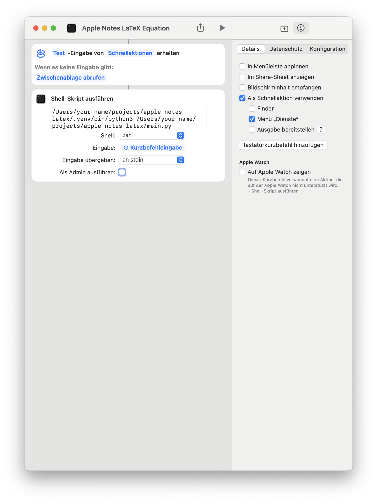
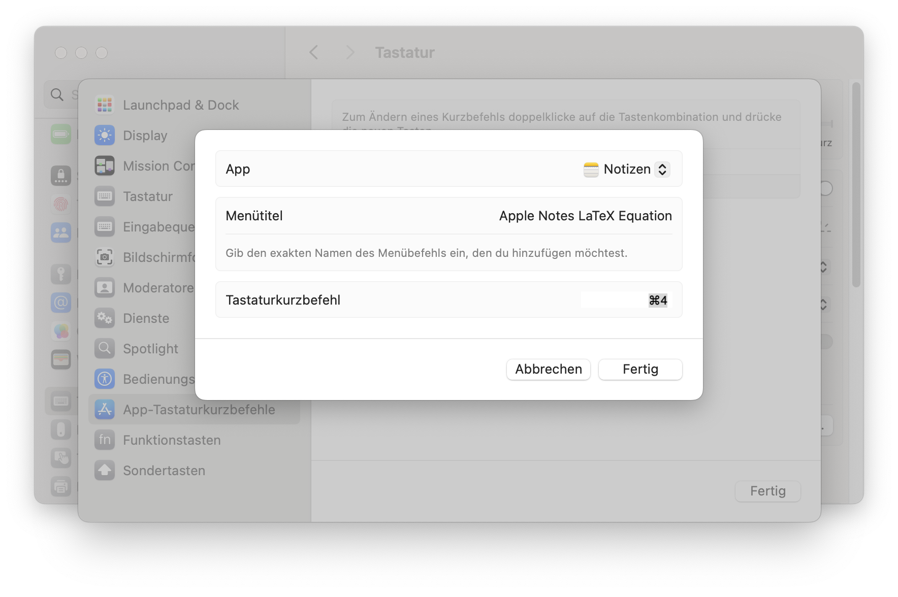

# Use LaTeX formula in Apple Notes

## Usage

- Write LaTeX equation
- Select LaTeX equation
- Press shortcut
- Paste LaTeX equation as image

## Installation

- `python3 -m venv .venv --upgrade-deps`
- `. .venv/bin/activate`
- `pip install -r requirements.txt`
- Create new shortcut in the Shortcuts App
- Use `execute shell-script`
- Select only `Text` as input and `Get clipboard` if there is no input
- Copy full path of binary `.venv/bin/python` and paste it to `execute shell-script`
- Copy full path of file `main.py` and paste it after the path of python
- Choose method

### Method 1: Recommended

- Go to shortcut
- Click on details (up-right)
- Checkmark `Menu services`
- Open System Settings
- Navigate to Keyboard > Keyboard Shortcuts > App Keyboard Shortcuts
- Click on +
- Choose Apple Notes App
- Enter `Apple Notes LaTeX Equation`
- Choose a prefered keyboard shortcut

### Method 2: Keyboard-shortcut all apps

- Go to shortcut
- Click on details (up-right)
- Click on add keyboard shortcut

This method is not recommended because the keyboard shortcut will work on all apps.

## Resources

- https://support.apple.com/de-de/guide/shortcuts-mac/apd163eb9f95/mac